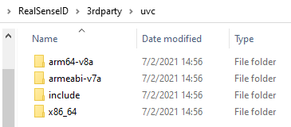

# 			Intel RealSense ID Examples


[Instructions for Windows](#windows----compilation-and-usage)

[Instructions for Linux](#linux----compilation-and-usage)

[Instructions for Android](#Android)

## **Windows** -  Compilation and usage 

##  **Dependencies**:

 -  **[CMake](https://cmake.org/)**
-   **[Visual Studio](https://visualstudio.microsoft.com/downloads/)**
-   **[OpenCV](https://sourceforge.net/projects/opencvlibrary/files/4.3.0/opencv-4.3.0-vc14_vc15.exe/download)** (Recommended for C# version in order to use the example app with preview) 


##  **How to build:**
Use CMake version 3.13.0 or above:

**Default build:**
 1. Download or Clone the repository.
 2. In cloned folder, open command line and run the following:
```console
> mkdir build
> cd build
> cmake ..
```

**Build with OpenCV (for C# preview):**
1.  Install precompiled OpenCV on Windows:
	1. Download [opencv-4.3.0-vc14_vc15.exe](https://sourceforge.net/projects/opencvlibrary/files/4.3.0/opencv-4.3.0-vc14_vc15.exe/download)
	2. Extract installation to: ***C:\openCV_4.3***
	3. Set Environment variable ***OpenCV_DIR*** pointing to ***C:\openCV_4.3\opencv\build*** folder.
	
2. Build as following:
```console
> mkdir build
> cd build
> cmake -D RSID_PREVIEW=1 ..
```

3. In build folder you should have full visual studio solution. run RealSenseID.sln.
4. Build solution.
5. Copy from ***C:\openCV_4.3\opencv\build\x64\vc15\bin\*** the files: [opencv_world430.dll, opencv_world430d.dll] to your sample binary location \<RealSenseID repository\>/build/bin/ <Debug/Release>
5. After building solution you will find in \build\bin\<Debug/Release> three executables:
-  rsid_csharp_example.exe
-  rsid_cpp_example.exe
- rsid_c_example.exe

**Done!**
## **How to run example apps**

***Make sure you have connected the Intel RealSense ID F450 / F455 device to your PC***.

Run Windows "Device Manager" and check in which COM port the device was recognized (It should appear under **Ports (COM & LPT)** (For example: COM3)

###  **C# Example:**
1. Edit **"rsid_csharp_example.exe.config"** file located in bin folder (where .exe files are located) as following:
	 - Edit COM number to like the one you saw previously at Device Manager
	 - Edit USB Type - to USB or UART depends of the connection you choose to connect the device to.
2. Simply Run: **rsid_csharp_example.exe**


###  **C++ Example:**
At bin folder (where .exe files are located) run command line and run the app as following:
```console
rsid_cpp_example.exe <port> <usb/uart>
```
For Example:
```consol
rsid_cpp_example.exe COM3 usb
```

###  **C Example:**

At bin folder (where .exe files are located) run command line and run the app as following:
```console
rsid_c_example.exe <port> <usb/uart>
```
For Example:
```console
rsid_c_example.exe COM3 usb
```

## **Linux** -  Compilation and usage 

***  instructions for Ubuntu 18.4 ***

##  **Dependencies**:

 -  **[CMake](https://cmake.org/)** - 3.13.0 or higher.

##  **How to compile**:

 1.  Download or Clone the repository.
 2. In main folder, Open Terminal and run the following:
 ```console
 > mkdir build
 > cd build
 > cmake ..
 > make
 ```
3. After building solution you will find in \build\bin\ two executables:
	1. rsid_c_example
	2. rsid_cpp_example

**Done!**

## **How to run example apps**

***First make sure you have connected the Intel RealSense ID F450 / F455 Camera to your PC***.

1. Check in which Port the device was recognized by running:
	```consoll 
	dmesg 
	```
	**(you should see something like: ACM#<# port number>)**
    
2. Grant permission to that USB port by running the following command  (# -  Port number):
	```consoll 
	sudo chmod 777 /dev/ttyACM#
	```

###  **C++ Example:**
At bin folder (where .exe files are located) run command line and run the app as following:
```console
./rsid_cpp_example <port> <usb/uart>
```
For Example:
```console
./rsid_cpp_example.exe COM3 usb
```

###  **C Example:**

At bin folder (where .exe files are located) run command line and run the app as following:
```console
./rsid_c_example <port> <usb/uart>
```
For Example:
```console
./rsid_c_example.exe COM3 usb
```

## **Android**

## **Dependencies**:
- **[Android Studio](https://developer.android.com/studio)**
- **[SWIG](http://www.swig.org/download.html)**
- **[LibUSB](https://github.com/libusb/libusb)**
(Currently required - later will only be required to enable preview)
- **[LibUVC](https://github.com/libuvc/libuvc)**
(Currently required - later will only be required to enable preview)

##  **How to build:**
### **Prerequisites**
- `SWIG` is used to create the JNI and Java wrappers to RealSenseID C++ API. Please download and install SWIG-4.0.2 or newer in your development environment to enable wrapper code generation during CMake builds. If developing in Windows, it's suggested to download swigwin-4.0.2 or later, install it and add it to PATH environment variable. For other development OSes, please follow instructions [online](http://www.swig.org/Doc4.0/SWIGDocumentation.html#Preface_installation) on how to compile and install from source.
- `LIBUSB & LIBUVC` are required for preview in Android. Currently, preview support must be part of Android compilation (RSID_PREVIEW flag must be set to ON). The developer can choose if to compile both libraries from source for Android OS and the [ABI](https://developer.android.com/ndk/guides/abis) matching the destination platform, or take the libraries we precompiled and shared in the [releases section](https://github.com/IntelRealSense/RealSenseID/releases).

**Build sample APK**
 1. Download or Clone the repository.
 2. Copy LibUSB and LibUVC header folder (include) and precompiled binaries devided by ABI folders (x86_64, arm64-v8a etc...) to \<RealSenseID repository\>/3rdparty/uvc. It should look similar to this: 
 3. In Android Studio, File->Open: \<RealSenseID repository\>/examples/android_example
 4. "Sync project" and then "Make project".

 **Done!**
## **How to run example application**
- Install the sample application on an Android device.
- Connect Intel RealSense ID F450 / F455 device to an OTG supported Android device.
- Run the sample application and when asked for, grant the application permission to access the Realsense ID F45# device.